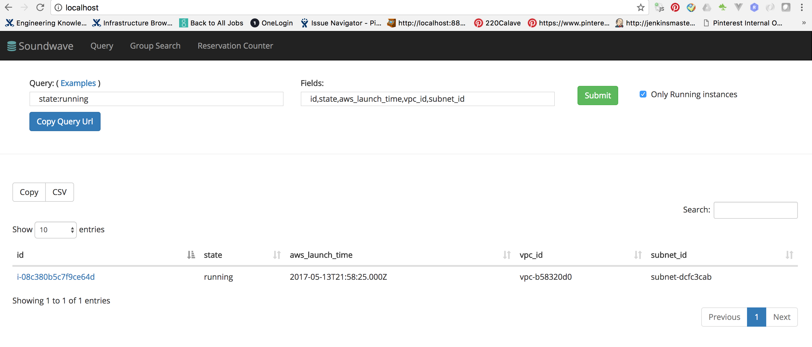

# Soundwave



# What is soundwave
Soundwave is a searchable EC2 inventory store. It tracks all the current and historic EC2 instances with their metadata.
It has three parts:

* A java based worker system to synchronize EC2 data and push to the elastic search store.
* A RESTful API layer to provide access to instance data and search.
* A UI dashboard for end users to perform ad hoc search.

At Pinterest, Soundwave is the foundation of our Configuration Management Database which serves as the source of truth for our EC2 instance information.
The data is used for service management, visibility, and finance purposes.


# Why use soundwave

Soundwave is useful for companies which operate EC2 at scale and require to track usage and instance meta data.
It helps address the following issues:
1. AWS EC2 API has rate limit, which make it unsuitable to directly query for machine information. 
2. AWS does not persist metadata and instance information for terminated instances.  
3. In AWS, EC2 schema can only be extended in a limited way with the use of tags.
4. The EC2 API has very limited support for querying beyond simple filtering

# Getting Started

#### 1. Clone the repository

```
git clone https://github.com/pinterest/soundwave.git
```

#### 2. Setup AWS Credentials


Soundwave uses [Terraform](https://www.terraform.io/) to provision the required infrastructure for running the service.

[Terraform](https://www.terraform.io/) requires AWS credentials (Access and Secret Key) of a privileged user. 
```
$ vi soundwave/terraform/soundwaveaws.tf
----------------------------------------

provider "aws" {
  access_key = "<<Your Access Key>>"
  secret_key = "<<Your Secret Key>>"
  region     = "<<Your AWS Region>>"
} 
```
#### 3. Run Terraform


```
$ cd soundwave/terraform
$ terraform apply
```

#### 4. Update Properties


Use the AWS region and your account number in the fields shown below

(Note: Account Number is available on the AWS console under MyAccount section)
```
$ vi soundwave/worker/config/soundwaveworker.properties
-------------------------------------------------------

aws_region=us-east-1
update_queue=https://sqs.us-east-1.amazonaws.com/<accountnumber>/soundwave-events
```

#### 5. Build the project


```
mvn clean package
```

#### 6. Update docker-compose


Update the docker-compose.yml file to use your AWS Access and Secret keys
```
$ vi soundwave/docker-compose.yml
---------------------------------

version: '2'
services:
  soundwave-worker:
    build: ./worker
    environment:
      - CONFIG_FILE=config/soundwaveworker.properties
      - TEST_CONFIG=1
      - AWS_ACCESS_KEY_ID=<<key_id>>
      - AWS_SECRET_ACCESS_KEY=<<access_key>>
```

#### 7. Run docker-compose


```
docker-compose up
```

#### 8. Create Elastic search indexes


```
$ cd worker/scripts
$ ./provision_index.sh http://localhost:9200/soundwave_prod
$ ./provision_index.sh http://localhost:9200/soundwave_ss
```

#### 9. Launch an EC2 instance through the AWS console or aws-cli command line

#### 10. See the results

Results can be seen on one of the following:

##### UI [http://localhost:80](http://localhost:80)
##### API [http://localhost:8080/v2/instance/<instance_id>](http://localhost:8080/v2/instance/<instance_id>) 
##### Elasticsearch [http://localhost:9200/soundwave_prod/_search](http://localhost:9200/soundwave_prod/_search)

```
{
   "took": 38,
   "timed_out": false,
   "_shards": {
      "total": 1,
      "successful": 1,
      "failed": 0
   },
   "hits": {
      "total": 1,
      "max_score": 1,
      "hits": [
         {
            "_index": "soundwave_prod",
            "_type": "instance",
            "_id": "i-01c085b645bffcf6f",
            "_score": 1,
            "_source": {
               "id": "i-01c085b645bffcf6f",
               "region": "us-east-1",
               "location": "us-east-1b",
               "state": "running",
               "created_time": "2017-03-21T18:57:56.571+0000",
               "updated_time": "2017-03-21T18:58:27.577+0000",
               "terminated_time": null,
               "vpc_id": "vpc-b58320d0",
               "subnet_id": "subnet-dcfc3cab",
               "aws_launch_time": "2017-03-22T03:49:18.000+0000",
               "security_groups": null,
               "security_group_ids": null,
               "tags": null,
               "cloud": {
                  "aws": {
                     "subnetId": "subnet-dcfc3cab",
                     "kernelId": null,
                     "ramdiskId": null,
                     "virtualizationType": "hvm",
                     "amiLaunchIndex": 0,
                     "enaSupport": true,
                     "stateReason": null,
                     "sourceDestCheck": true,
                     "platform": null,
                     "instanceId": "i-01c085b645bffcf6f",
                     "vpcId": "vpc-b58320d0",
                     "hypervisor": "xen",
                     "rootDeviceName": "/dev/xvda",
                     "state": {
                        "code": 16,
                        "name": "running"
                     },
                     "productCodes": [],
                     "architecture": "x86_64",
                     "ebsOptimized": false,
                     "imageId": "ami-0b33d91d",
                     "blockDeviceMappings": [
                        {
                           "ebs": {
                              "volumeId": "vol-0305a977aad819e7f",
                              "deleteOnTermination": true,
                              "attachTime": 1490154559000,
                              "status": "attached"
                           },
                           "deviceName": "/dev/xvda"
                        }
                     ],
                     "stateTransitionReason": "",
                     "publicIpAddress": "54.242.222.37",
                     "clientToken": "EtnOD1490154557345",
                     "instanceType": "t2.micro",
                     "keyName": "lidaec2key",
                     "publicDnsName": "",
                     "monitoring": "disabled",
                     "iamInstanceProfile": null,
                     "privateIpAddress": "172.30.1.227",
                     "instanceLifecycle": null,
                     "rootDeviceType": "ebs",
                     "tags": [],
                     "launchTime": 1490154558000,
                     "spotInstanceRequestId": null,
                     "networkInterfaces": [
                        {
                           "networkInterfaceId": "eni-0c2febee",
                           "subnetId": "subnet-dcfc3cab",
                           "privateIpAddresses": [
                              {
                                 "association": {
                                    "ipOwnerId": "amazon",
                                    "publicIp": "54.242.222.37",
                                    "publicDnsName": ""
                                 },
                                 "privateDnsName": null,
                                 "privateIpAddress": "172.30.1.227",
                                 "primary": true
                              }
                           ],
                           "description": "Primary network interface",
                           "groups": [
                              {
                                 "groupName": "launch-wizard-8",
                                 "groupId": "sg-7465ce0b"
                              }
                           ],
                           "association": {
                              "ipOwnerId": "amazon",
                              "publicIp": "54.242.222.37",
                              "publicDnsName": ""
                           },
                           "ipv6Addresses": [],
                           "ownerId": "093574427811",
                           "sourceDestCheck": true,
                           "privateIpAddress": "172.30.1.227",
                           "macAddress": "0a:f0:41:07:19:aa",
                           "attachment": {
                              "attachmentId": "eni-attach-3a2f6802",
                              "deleteOnTermination": true,
                              "deviceIndex": 0,
                              "attachTime": 1490154558000,
                              "status": "attached"
                           },
                           "vpcId": "vpc-b58320d0",
                           "privateDnsName": null,
                           "status": "in-use"
                        }
                     ],
                     "sriovNetSupport": null,
                     "privateDnsName": "ip-172-30-1-227.ec2.internal",
                     "securityGroups": [
                        {
                           "groupName": "launch-wizard-8",
                           "groupId": "sg-7465ce0b"
                        }
                     ],
                     "placement": {
                        "availabilityZone": "us-east-1b",
                        "groupName": "",
                        "tenancy": "default",
                        "hostId": null,
                        "affinity": null,
                        "availability_zone": "us-east-1b"
                     }
                  }
               },
               "aws_status": null,
               "token": null,
               "cached": 0
            }
         }
      ]
   }
}
```
# License
[Apache License, Version 2.0](https://www.apache.org/licenses/LICENSE-2.0)


